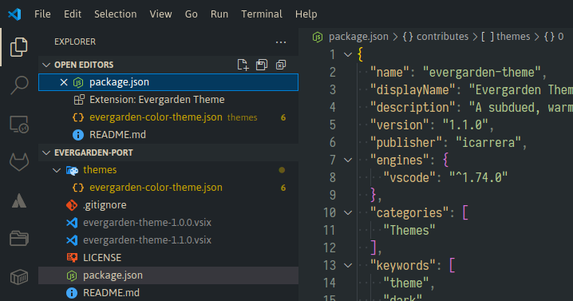
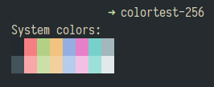

# Evergarden Theme for VS Code

Ported from [Chroma's Evergarden](https://github.com/alecthomas/chroma/commit/6f1db96235a34cc677c7ac09370fde2993030e6f)
automatically via Claude AI Agent.

Originally [comfysage](https://github.com/everviolet/nvim).

## Editor Screenshot

## Terminal Colors Screenshot

